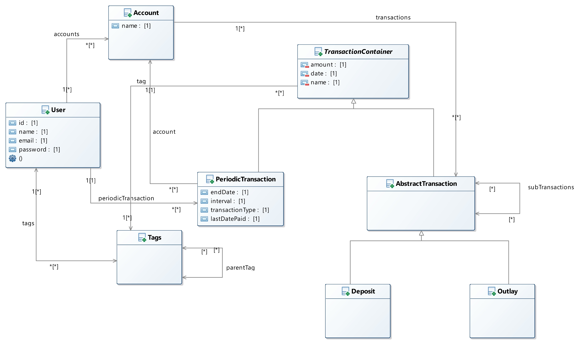
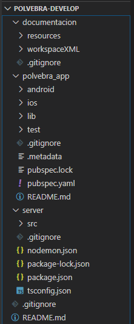

# polvebra
Application to manage how do you expense your money

## Introduction
Polvebra is a free use mobile app. The objetive of this apps borns whit my own need to manage my money. It was my first month working I saw that I expense my money without control. 
I'm also an enthusiastic of technology and I want to learn more about. So I thought it could be a nice chance to start new technologys.

The app is absolutly free, just for fun and learning (English too documentation in English, sorry for the mistakes), and posted in GitHub as my own portfolio. Also I want three more things posting this here. In first place, I'll try to document it the better I can, so if somebody needs it in the futher to learn or take some code, you can (If you take something, please reference me). The second one if somebody wants to colaborate, he can, just talk me. And the last thing is if somebody see an error, in the code, the conception, the software engineering... Please talk me.

All donations to help me are welcome. With donations I'll rent better servers our is a way to monetise all the time in this project and a motivation for other free projects.

Thank you so much reading this. I hope you like the project.

## Documentation
While the project is in develop, the documentation will be incomplete.

### Informal description of the problem
I will take about the concepts that will appear in the application and finally what its the idea of the display.

#### Concepts
##### Account
The account how you view an account. For example you can have several accounts in differents or the same banks. Thas will represent this concept. The default account will be the cash account. That will represent the money in your pocket. At the moment, any account has the same values as the name, the current amount, the transactions you did in there...

##### Amount
This concept will talk about the money you have in each account and in all the accounts. There will be to types of amount. Your amount, its will be the money you have right now an the other the net amount. You will can put an outlay as unpaid. In this case, the net amount will show you the money you would have if you had paid that.

##### Transaction

This concept represents the movement of money. All the transactions have commons values. One is the the name, the money of the transaction, the date, the value of is paid, the tag... 
There are two differents types of transactions:
- Deposit: It's when the money is into your account.
- Outlay: It represents the expense of the money.

You can also define a periodic transaction. For example, you can put in there your salary. With that you can automatice the creation of transactions, in this case, deposits. You can put when you start with this periodic transactions (And/Or how many did you had before), what is the period you have this transaction, when it finish (or not)...

Also you can do a transer between accounts, that wont compute as expense/income. That will manage for example, if you withdraw, it won't compute.

##### Tag
Every transaction will be classified in Tags. If you don't specify any, this will be classified in a default Tag. This tags represents the nature of the transaction. You can create subtags in a tag, for example, if you buy a keyboard, the tag could be Peripheral wihtch one is son of Hardware witch is son of Computer.

That will be a piece very importat for the analysis.

#### Functionality
The first one it's can manipute all the elements previusly declared, the famous CRUD, create, remove update and delete.

The other one is the analysis of the data. This part I think it could be the most valuable. In this one you can search (For an account, several or all of them) the transaction values. The searcher will let you filter by date and/or tag. For example you can search how many did you spend going out dinner, in one of the several supermarket even in what products. That could give you a complete view of all the ways do you expense your money, view your main ways of incomes.. This output will be plots in differents graphs.

#### App display
This app will try a find a way to manage the movement of your money. This will be valid for a single person to manage his salary or a small company. 

The first screen the user will have is an login/register page, where the user will have to login with his credentials or create an account. In the future could be implemented login with Google or Facebook.

Once you are you are logged you will have an main dashboard. In this dashboard you will see your amount you have and your "net" amount (I will explain this concept later). You will also have the amounts in all your virtual accounts (Banks accounts, cash, etc.) And a button to create a transacion.

You will have in the left part of the screen a main menu. This menu will show the next things:
- **Accounts**: Opens a new screen with more details of yours accounts.
- **Transactions**: Opens a new screen with all your transactions in all accounts. This will be able to be sorted by date or name, by  default, the lastest day.

### Object definition and business rules
- **User**:
	- name: String
	- username: String
	- email: String
	- password: String
	- accounts: List(Account)
	- tags: List(Tag)
	- periodicTransactions: List(PeriodicTransaction)
	- Restrictions:
		- The email must be unique.
		- The username must be unique.

- **Account**:
	- name: String
	- transactions: List(Transaction)
	
- **Tag**
	- name: String
	- description: String
	- partentTag: Tag
	
- **TransactionContainer**:
	- name: String
	- tag: Tag
	- amount: number
	- date: Date
	- Types: 
	
		- **AbstractTransaction**:
			- subtransaction: List(AbstractTransaction)
			- paid: boolean
			- Restrictions:
				- The subtransactions had to be the same class
				
		- **PeriodicTransaction**
			- account: Account
			- endDate: Date
			- interval: number
			- transactionType: String
			- lastDate: Date

### Domain

### User cases

## Installations 
In this section I will take about the places you could download all the software for work with this repository. I will post all the things I thing you could need for the correct work.

### Directory Tree
The directory tree you will find is 

In this Tree you will find three main folders. 
- The first one is the documentation folder. There you can find the UML workspace. Also you will find a resources folder, where the pictures used in this documentation will be.
- The second one is the front end project. Is the flutter project when you will find the code where the app is done.
- The last one is the server, back end, project. There you will find all the NodeJS project.

### Documentation 
- **Documentation**: For documentation I'm writing this markdown file. I edited this here https://pandao.github.io/editor.md/en.html#H4%20header . This is an online plataform to write your Markdown files and see the preview at the moment. You can use your prefer text editor. I used this because is more cozy to me.

- **UML**: For the UML Desings I use UML Designer. Currently I used 9.0.0 version, I think is complatible with others, but I used it. The download link is http://www.umldesigner.org/download/ . I think if you have a eclipse version alredy, you can use it with a plugin, but I'm not sure. This need a jdk version in your computer. This link is multiplataform.

### Backend
- **Mongodb**: The current DB is MongoDB. This is an multiplataform NoSQL database. I used 4.2.7 version, I dont know if it works with other, I think so. 
The version I downloaded (for windows) is that https://www.mongodb.com/dr/fastdl.mongodb.org/win32/mongodb-win32-x86_64-2012plus-4.2.7-signed.msi/download . For general download you can go here: https://www.mongodb.com/download-center/community

- **Robo 3T**: This app is just a visual support to manage your MongoDB. The download links I used is: 
	- **Windows 64 bits**: https://download-test.robomongo.org/windows/robo3t-1.3.1-windows-x86_64-7419c406.zip

- **Nodejs (With Typescript)**: I used 12.17.0 version for NodeJS. The download link for multiplataform is https://nodejs.org/dist/v12.17.0/ . NodeJS is the framework I used for back end. To give a more typed coding an for having more compile options, I use Typescript instead of JavaScript. All the dependences you will need for the backend it's included in the *package.json*, for install them, just npm install at server folder.

- **Postman**: It is the program I used to make request to API developing. The download link is https://www.postman.com/downloads/

- **VSCode**: I use this IDE for backend develop, you can use whatever you want, even *nano* if you want. The download link for VSC is https://code.visualstudio.com/Download

All you will need to start coding the back end is have installed mongodb and be sure the services is running. After that, with NodeJS installed too, you can go to server folder. In there you will have to run in console *npm install*. That will install all the dependecies the back needs. When you have done that you have some options to run the back end:
- *npm run ts-node:* This option is the most useless option. That will run the project and nothing else.
- *npm run build:* That command will build the typescript code into JavaScript code, how is the language NodeJs works. This will compile the code into *./build* folder.
- *npm run clean:*  This command will remove the *./build* folder.
- *npm run start:*  This command will run the backend already compiled.
- *npm run dev:*  This command will run the backend directly in TS and with nodemon. The meaning of that is than you will have a hot reload from changes. When you code something and you save the changes, the back will be re-runned with the changes automatically.
- *npm run test:*  This command will run the test suites for the backend.

The code uses a log file. To see it in the terminal, the Windows alternative to *tail -f file.log* is *Get-Content file.log –Wait* in the powershell

### Frontend
This part is unstarted, so I will post it when I have the version I use. The technologys I will use is the next one:
- **Flutter**:

- **Dart**:

- **Android Studio**:
